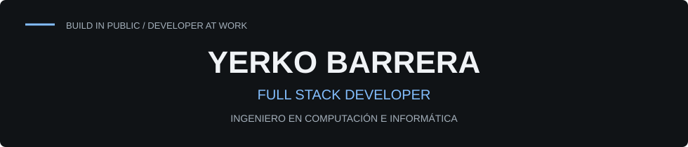
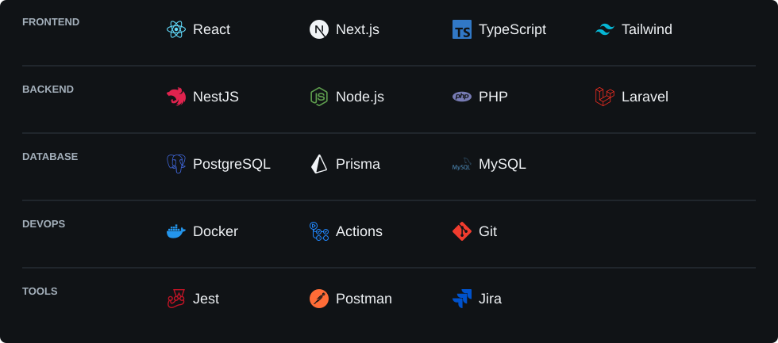
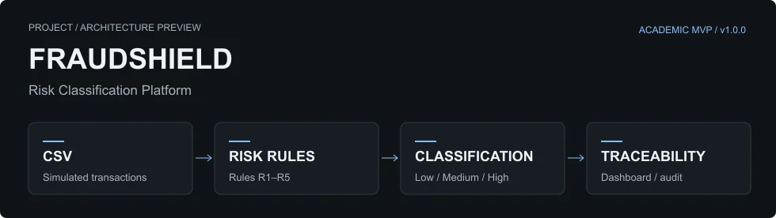
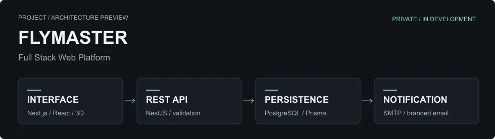
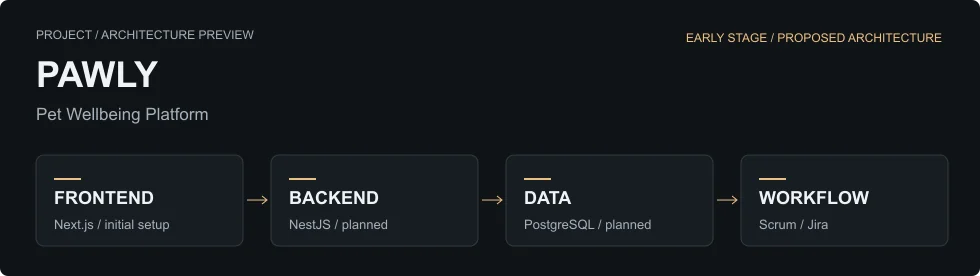
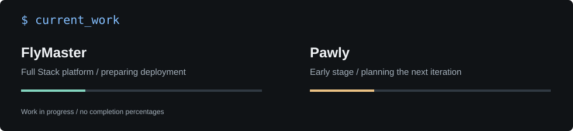
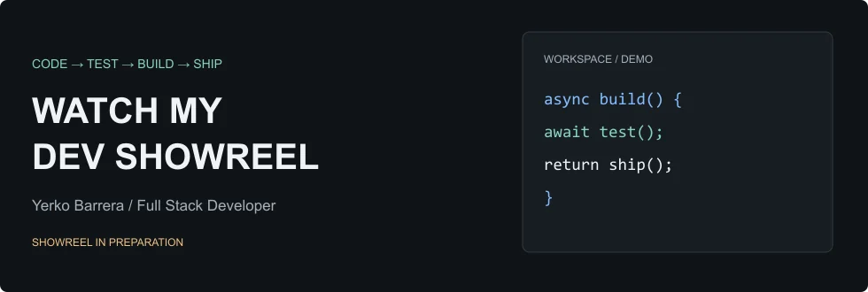

<picture>
  <source media="(prefers-reduced-motion: reduce)" srcset="assets/animations/developer-workflow-poster.svg">
  <source media="(max-width: 600px)" srcset="assets/animations/developer-workflow-mobile.svg">
  
</picture>

<b>Building real-world software.</b> Build in public. Learn through projects.

Ver la sesión en texto

Workspace → código → pruebas → Git → arquitectura Full Stack → proyectos.
La animación es una sesión ilustrativa, no un reporte real de tests o despliegues.

## Who am I

Soy **Yerko Andrés Barrera Pantoja**, Ingeniero en Computación e Informática de la **Universidad Andrés Bello**, mención Desarrollo de Software. Construyo aplicaciones Full Stack y sigo aprendiendo con proyectos reales.

Mi experiencia en **TI, soporte N1/N2 y continuidad operativa**, junto con desarrollo freelance en PHP/Laravel, me ayuda a conectar el código con los problemas que necesita resolver.

whoami / terminal

 

## Tech stack

<picture>
  <source media="(max-width: 600px)" srcset="assets/stack/tech-stack-mobile.svg">
  
</picture>

**Mi foco:** interfaces responsive, APIs REST, persistencia, validación y pruebas. Trabajo con Jest, Supertest, Playwright, ESLint, Docker Compose y revisión de código; organizo el desarrollo con Scrum y Jira.

## Featured projects

### [FraudShield](https://github.com/koyarxs/Project-01-FraudShield-Septiembre-2026)

**Proyecto de título · MVP v1.0.0 estable.** Clasificación de riesgo transaccional por lotes, reglas, score y trazabilidad. Datos simulados; clasifica riesgo, no confirma fraude.

`Next.js` · `NestJS` · `PostgreSQL` · `Prisma` · `JWT` · `Docker`

[View project →](https://github.com/koyarxs/Project-01-FraudShield-Septiembre-2026)

### FlyMaster

**Proyecto privado · En desarrollo.** Plataforma de servicios aéreos con landing responsive, flota 3D, portafolio y consultas guardadas con notificación por correo.

`Next.js` · `React` · `Three.js` · `NestJS` · `PostgreSQL` · `Prisma Next`

[Conversar sobre el proyecto →](https://www.linkedin.com/in/yerko-andr%C3%A9s-barrera-pantoja-a82821123/)

### [Pawly](https://github.com/koyarxs/Project-04-Pawly-Octubre-2026)

**Proyecto personal · Etapa inicial.** Plataforma para el bienestar de mascotas. Frontend Next.js iniciado; evolución Full Stack planificada, con Scrum y Jira.

`Next.js` · `React` · `TypeScript` / **Stack propuesto:** `NestJS` · `PostgreSQL` · `Prisma` · `Docker`

[View project →](https://github.com/koyarxs/Project-04-Pawly-Octubre-2026)

## Currently building

## GitHub activity

### Public profile / stats

### Contribution activity

Contribution animation

 
<picture>
  <source media="(prefers-color-scheme: dark)" srcset="assets/animations/contribution-dark.svg">
  
</picture>

## Dev showreel

Showreel en preparación. El enlace al video se añadirá cuando esté publicado.

## Let's connect

**Construyo, aprendo, pruebo y sigo avanzando.**

[LinkedIn](https://www.linkedin.com/in/yerko-andr%C3%A9s-barrera-pantoja-a82821123/) · [CV profesional](https://github.com/koyarxs/Project-02-CV-Yerko-Barrera-Septiembre-2026) · [Repositorios públicos](https://github.com/koyarxs?tab=repositories)

