<picture>
  <source media="(max-width: 600px)" srcset="assets/banners/hero-developer-room-mobile.svg">
  
</picture>

# Hi, I'm Yerko Barrera

**Software Engineer · Full Stack Developer**<br>
Ingeniero en Computación e Informática · Licenciado en Ingeniería · Chile

**Building software, learning every day and turning ideas into code.**

[LinkedIn](https://www.linkedin.com/in/yerko-andr%C3%A9s-barrera-pantoja-a82821123/) · [CV](https://github.com/koyarxs/Project-02-CV-Yerko-Barrera-Septiembre-2026) · [Project Laboratory](#project-missions) · [Current Stack](#stack-inventory)

Bienvenido a mi pequeño mundo de desarrollo. Soy un ingeniero recién titulado, con experiencia previa en **soporte TI**, construyendo activamente mi camino en **Ingeniería de Software y Desarrollo Full Stack**. Hay herramientas que uso y mundos que recién estoy explorando: este no es un inventario de expertise.

<details>
<summary>Open terminal / whoami</summary>


```text
$ whoami
Yerko Barrera
$ education
Ingeniero en Computación e Informática / Licenciado en Ingeniería
$ role
Software Engineer / Full Stack Developer
$ current_mission
Build. Learn. Improve.
$ location
Chile
$ status
Ready to code
```

</details>

## Player Profile


**Player:** Yerko Andrés Barrera Pantoja · **Background:** Soporte TI · **Status:** Building & Learning.<br>
**Main quest:** Become a stronger Software Engineer. “Online” es un guiño de videojuego, no mi disponibilidad en tiempo real.

## About This Developer

Soy **Ingeniero en Computación e Informática y Licenciado en Ingeniería**, recién titulado de la Universidad Andrés Bello, con mención Desarrollo de Software. Mi experiencia en soporte TI N1/N2 me enseñó a investigar problemas, escuchar a las personas y cuidar la continuidad operativa.

Hoy construyo proyectos Full Stack para aplicar lo que aprendo. También cuento con experiencia freelance en **PHP/Laravel**. Quiero seguir fortaleciendo arquitectura, DevOps, cloud, seguridad, testing y mobile, paso a paso y con proyectos como terreno de práctica.

## My Tech Universe

<picture>
  <source media="(max-width: 600px)" srcset="assets/svg/tech-universe-map-mobile.svg">
  
</picture>

**Active** = aplicado en proyectos. **Leveling up** = práctica y profundización. **Future quest** = roadmap, no experiencia acreditada. Las escenas son ilustraciones originales, no reportes de sistemas funcionando.

### Frontend Island


**Stack de trabajo:** HTML5, CSS3, JavaScript, TypeScript, React, Next.js y Tailwind CSS. **En exploración:** Vite. Interfaces responsive, componentes y conexión con APIs.

### Backend Factory


**Aplicado:** Node.js, NestJS, Express, TypeScript y APIs REST; PHP/Laravel en trabajo freelance. **Profundizando:** contratos con Swagger/OpenAPI.

`REQUEST → API → SERVICE → DATABASE → RESPONSE`

### Database Cave


**Aplicado:** PostgreSQL, SQL, Prisma ORM y MySQL. **En profundización:** MongoDB, modelado y decisiones de persistencia. Aprender también significa saber cuándo no agregar otra base de datos.

<details>
<summary>Explore Mobile Lab / React Native</summary>


**Future quest:** React Native. Próximo espacio de experimentación, no experiencia profesional actual.

</details>

<details>
<summary>Explore Bug Hunter Lab / quality & testing</summary>


**Aplicado:** Jest, pruebas E2E con Playwright, Supertest y ESLint. **Roadmap:** Vitest, Selenium, Oxlint, Prettier y SonarQube. Herramientas por explorar, no certificaciones ni dominio afirmado.

**No bugs were harmed during testing. Probably.** El resultado de la escena es ficticio; los tests reales viven en cada repositorio.

</details>

<details>
<summary>Explore DevOps Harbor / containers & delivery</summary>


**Aplicado:** Docker, Docker Compose y GitHub Actions. **Leveling up:** pipelines CI/CD. **Future quest:** Kubernetes.

`CODE → CONTAINER → PIPELINE → DEPLOY`<br>
Kubernetes es una ruta futura, no una dependencia obligatoria de todos mis proyectos.

</details>

<details>
<summary>Explore Cloud City / exploring & learning</summary>


**Exploring & Learning:** AWS, Microsoft Azure y Cloudflare. Busco comprender despliegue, redes, costos y operación. No afirmo experiencia experta ni certificaciones cloud.

</details>

<details>
<summary>Explore Security Fortress / practice & learning</summary>


**Aplicado en proyectos:** JWT, autenticación/autorización, validación, variables de entorno, logging y auditoría. **Profundizando:** OWASP Top 10, secure coding, seguridad de APIs, gestión de secretos y análisis de vulnerabilidades en dependencias. No afirmo especialización en ciberseguridad.

</details>

<details>
<summary>Explore Architecture City / better foundations</summary>


**Práctica actual:** separación modular y responsabilidades. **Roadmap:** arquitectura hexagonal, microservicios, SOLID, Clean Code y patrones de diseño. Entender los costos importa tanto como aprender los nombres.

</details>

<details>
<summary>Explore Git Forest / branches & collaboration</summary>


Git y GitHub como herramientas diarias. Feature branches, Conventional Commits, Pull Requests y revisión de código como prácticas que sigo fortaleciendo.

`feature/* → Pull Request → Review → Merge`

</details>

<details>
<summary>Explore Quest Board / Scrum & Jira</summary>


Scrum y Jira para organizar el trabajo. **Backlog → To Do → In Progress → Code Review → Done**, sin simular tareas ni métricas de un equipo real.

</details>

<details>
<summary>Explore Developer Toolbox / everyday tools</summary>


VS Code, Postman y pgAdmin para escribir, probar e inspeccionar. Linux es parte de mi recorrido de sistemas y operación, no una certificación.

</details>

<a name="stack-inventory"></a>

### Current Stack & Learning Roadmap

<details>
<summary>Compact icon inventory / official logos</summary>


Los logos identifican herramientas, no certificaciones. El roadmap completo está en la tabla siguiente.

</details>

| Area | Applied / current practice | Learning roadmap |
| --- | --- | --- |
| Frontend | HTML, CSS, JS/TS, React, Next.js, Tailwind | Vite, refinamiento de UI |
| Backend | Node, Nest, Express, REST, PHP/Laravel | Swagger / OpenAPI |
| Database | PostgreSQL, SQL, Prisma, MySQL | MongoDB, modelado avanzado |
| DevOps | Docker, Compose, GitHub Actions | CI/CD más profundo, Kubernetes |
| Cloud | — | AWS, Azure, Cloudflare |
| Testing | Jest, Playwright E2E, Supertest, ESLint | Vitest, Selenium, Oxlint, Prettier, SonarQube |
| Tools | Git, GitHub, VS Code, Postman, pgAdmin, Jira | Linux y mejores prácticas de colaboración |
| Mobile | — | React Native |

## Skill Tree

<picture>
  <source media="(max-width: 600px)" srcset="assets/svg/skill-tree-mobile.svg">
  
</picture>

**Active:** frontend, backend, datos. **Leveling up:** testing, arquitectura, DevOps, seguridad. **Future quest:** cloud y mobile. Estados de un recorrido, no puntuaciones de conocimiento.

## Current Quest


**Main quest:** Become a stronger Software Engineer.<br>
**Side quests:** Full Stack Development · Software Architecture · DevOps · Cloud · Cybersecurity · Mobile Development · Advanced Testing.

> Progress indicators represent my learning journey, not objective proficiency scores.

<a name="project-missions"></a>

## Project Laboratory

### [FraudShield — Mission: Detect Risk](https://github.com/koyarxs/Project-01-FraudShield-Septiembre-2026)

[](https://github.com/koyarxs/Project-01-FraudShield-Septiembre-2026)

**Proyecto de título · MVP académico v1.0.0.** Clasificación de riesgo transaccional por lotes: reglas, score, dashboard y trazabilidad. Usa datos simulados; **clasifica riesgo, no confirma fraude**.

React · Next.js · TypeScript · NestJS · PostgreSQL · Prisma · Docker.<br>
[View repository](https://github.com/koyarxs/Project-01-FraudShield-Septiembre-2026)

### [Pawly — Mission: Pet Wellbeing](https://github.com/koyarxs/Project-04-Pawly-Octubre-2026)

[](https://github.com/koyarxs/Project-04-Pawly-Octubre-2026)

**In Development · Etapa inicial.** Proyecto personal orientado al bienestar de mascotas. Frontend Next.js iniciado; evolución Full Stack planificada.

**Actual:** Next.js, React, TypeScript. **Propuesto:** NestJS, PostgreSQL, Prisma, Docker.<br>
[View repository](https://github.com/koyarxs/Project-04-Pawly-Octubre-2026)

### FlyMaster — Mission: Connect Air & Web


**Building · Repositorio privado.** Plataforma Full Stack de servicios de drones y operación aérea: landing responsive, flota 3D, portafolio, consultas persistidas y notificación por correo.

Next.js · React · Three.js · NestJS · PostgreSQL · Prisma Next.<br>
[Repositorio privado](https://github.com/koyarxs/Project-03-FlyMaster-Octubre-2026) (requiere acceso) · [Conversar sobre el proyecto](https://www.linkedin.com/in/yerko-andr%C3%A9s-barrera-pantoja-a82821123/)

Escenas conceptuales, no capturas de aplicaciones terminadas. No publico consultas de clientes, secretos ni datos privados.

## How I Build Software

<picture>
  <source media="(max-width: 600px)" srcset="assets/animations/world-workflow-mobile.svg">
  
</picture>

Idea → Planning / Jira → Feature Branch → Development → Testing → Pull Request → Code Review → CI/CD → Deployment. Un proceso que sigo mejorando; la animación no representa ejecuciones reales.

## Player Stats

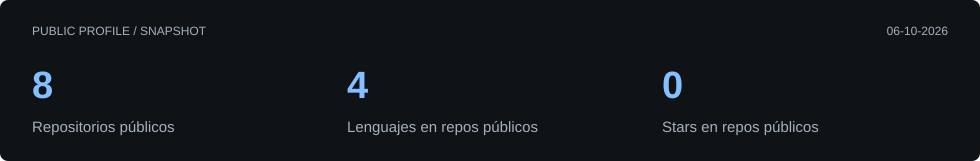

Snapshot generado desde la API de GitHub, actualizado diariamente por el workflow existente. No mide productividad. Los lenguajes se basan en el lenguaje principal de los repositorios públicos: no son un ranking de expertise.

## Code Garden


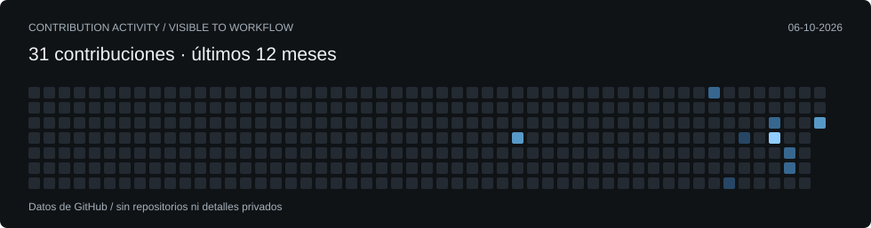

Cada contribución ayuda a crecer mi jardín digital. Los datos vienen de GitHub; las plantas no agregan ni modifican contribuciones. El snapshot refleja lo visible para el workflow, no todo el trabajo privado.

<details>
<summary>Watch the contribution snake / generated from GitHub</summary>

<picture>
  <source media="(prefers-color-scheme: dark)" srcset="assets/animations/contribution-dark.svg">
  
</picture>

</details>

## Boss Battles


Unexpected Bug · Dependency Conflict · Production Error · Docker Networking · Merge Conflict · npm dependency chaos.<br>
Herramientas: tests, logs, debugger, Git y stack traces. **Every bug is just another boss fight.**

## Life Outside Code

<details>
<summary>Gaming / sometimes even developers need to respawn</summary>


**Gaming sometimes — because even developers need to respawn.** Juego de vez en cuando para distraerme y recargar.

</details>

<details>
<summary>Music & Chill / recharge</summary>


**Music, chill & recharge.** Hay espacio para bajar el ritmo también.

</details>

<details>
<summary>Coding for fun / curiosity</summary>


**Sometimes I code just because I want to know if an idea can actually work.**

</details>

<details>
<summary>Developer Energy / scientifically inaccurate</summary>


**These stats are scientifically inaccurate.** Humor, no métricas personales, de conocimiento ni productividad.

</details>

## Yerko's Dev Room

<picture>
  <source media="(max-width: 600px)" srcset="assets/illustrations/developer-room-mobile.svg">
  
</picture>

Mi ecosistema actual vive junto a sus próximas misiones: **React/Next · Node/Nest · PostgreSQL/MongoDB · Docker · Git/Jira · Testing · Security**; **Kubernetes, cloud y React Native** siguen en el roadmap. Ninguna ilustración transforma aprendizaje en experiencia profesional.

<details>
<summary>Meet the cast / original characters & easter eggs</summary>

**Yerko:** desarrollador adulto con hoodie; no es un retrato realista. Construye, prueba, planifica, juega y descansa en poses distintas.<br>
**Byte:** robot transportista, ayudante del laboratorio y compañero del jardín.<br>
**Glitch:** bug travieso en la habitación, el laboratorio y la arena.<br>
**Nimbus:** nube exploradora de Cloud City. Yerko también asume los roles de constructor, tester y guardián digital.

Busca `TODO: sleep` en la habitación. Pista adicional: a veces el bug está más cerca del escritorio de lo que parece.

</details>

## Thanks for Visiting My Developer World!


**Always learning. Always building.**

```bash
$ git status
On branch life
Your journey is up to date.

$ git commit -m "keep learning"
Ready for the next challenge
```

**See you in the next commit.**<br>
[LinkedIn](https://www.linkedin.com/in/yerko-andr%C3%A9s-barrera-pantoja-a82821123/) · [CV profesional](https://github.com/koyarxs/Project-02-CV-Yerko-Barrera-Septiembre-2026) · [GitHub](https://github.com/koyarxs?tab=repositories)

<sub>Universo SVG original, sin JavaScript ni seguimiento. Animaciones decorativas con movimiento reducido; identidad, tecnologías y proyectos disponibles también en texto.</sub>
