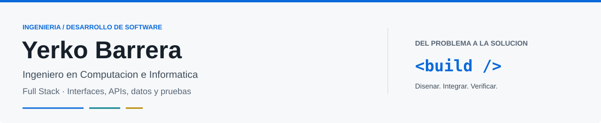

<picture>
  <source media="(prefers-color-scheme: dark)" srcset="assets/header-dark.svg">
  
</picture>

  
  
  

## Sobre mí

Soy **Yerko Andrés Barrera Pantoja**, Ingeniero en Computación e Informática de la **Universidad Andrés Bello**, mención Desarrollo de Software, con orientación **Full Stack**.

Tengo más de cuatro años de experiencia en TI, soporte N1/N2 y continuidad operativa, además de experiencia freelance en desarrollo de software. Hoy aplico esa base al diseño de aplicaciones que conectan **interfaces, APIs, datos y pruebas**.

Me interesa construir soluciones claras, mantenibles y útiles: desde una interfaz bien resuelta hasta una API validada, una base de datos consistente y un flujo de trabajo trazable.

> Mi enfoque: entender el problema, construir la solución y comprobar que funciona.

## Stack tecnológico

### Frontend

  
  
  
  
  

Interfaces responsive, componentes reutilizables, HTML5, CSS3 y CSS Modules. Experiencia con Vite y visualización interactiva con Three.js en FlyMaster.

### Backend y datos

  
  
  
  
  

APIs REST, SQL, validación de entradas, autenticación JWT y autorización. Integración entre frontend, backend y persistencia; correo transaccional con SMTP y Nodemailer.

**Experiencia complementaria:** PHP, Laravel, Express, MongoDB, pgAdmin y MySQL Workbench. Mi trabajo freelance con PHP/Laravel y MySQL complementa el stack TypeScript de mis proyectos actuales.

### Calidad y herramientas

  
  
  
  
  
  

Docker Compose, pruebas unitarias y E2E, Supertest, Selenium, ESLint y verificación de builds. Trabajo con Git/GitHub, revisión de código, Scrum y Jira para mantener cambios y decisiones trazables.

## Proyectos destacados

### [FraudShield](https://github.com/koyarxs/Project-01-FraudShield-Septiembre-2026)

**Proyecto de título · MVP v1.0.0 estable**

Clasificación de riesgo transaccional con carga CSV, procesamiento por lotes, reglas, score, dashboard y trazabilidad. Trabaja con datos simulados y clasifica riesgo; no confirma fraude.

`Next.js` · `NestJS` · `PostgreSQL` · `Prisma` · `JWT` · `Docker`

### [Pawly](https://github.com/koyarxs/Project-04-Pawly-Octubre-2026)

**Proyecto personal · En desarrollo**

Plataforma orientada a la gestión del bienestar de mascotas, desarrollada progresivamente con Scrum, Jira y revisión de código.

`Next.js` · `NestJS` · `TypeScript` · `PostgreSQL` · `Prisma` · `Docker`

### FlyMaster

**Proyecto privado · En desarrollo**

Plataforma de servicios aéreos con landing responsive, flota 3D, planes, portafolio y consultas persistidas con notificación por correo.

`Next.js` · `React` · `Three.js` · `NestJS` · `PostgreSQL` · `Prisma Next` · `QA`

### [CV profesional ATS](https://github.com/koyarxs/Project-02-CV-Yerko-Barrera-Septiembre-2026)

Generador de CV a partir de una fuente de datos tipada, con HTML semántico y formato preparado para impresión.

`TypeScript` · `Node.js` · `Node Test Runner` · `ESLint`

## Lo que aporto

- **Visión de extremo a extremo:** conectar experiencia de usuario, lógica de negocio, API y datos.
- **Calidad verificable:** validar entradas, probar flujos y revisar resultados de lint, tipos y compilación.
- **Base operativa en TI:** entender incidencias, documentar soluciones y considerar la continuidad del servicio.
- **Trabajo ordenado:** mantener contratos claros, cambios enfocados y control de versiones trazable.

## Trayectoria y formación

| Etapa | Experiencia |
| :--- | :--- |
| 2021–2022 | Soporte TI en Nutech / Universidad Andrés Bello. |
| 2022–2025 | Soporte N1/N2 en TIC Services / Hospital Gustavo Fricke. |
| 2025–2026 | Soporte TI en Grupo Belator. |
| 2025 | Desarrollo de software freelance en Reimpact con PHP, Laravel y MySQL. |
| 2024–2026 | Ingeniería en Computación e Informática, Universidad Andrés Bello. **Titulado**, mención Desarrollo de Software. |
| 2020 | Técnico Programador Computacional, Instituto Profesional AIEP. **Titulado**. |

La experiencia detallada y los cursos están disponibles en mi [CV profesional](https://github.com/koyarxs/Project-02-CV-Yerko-Barrera-Septiembre-2026).

---

**¿Conversamos sobre desarrollo de software?** Puedes encontrarme en [LinkedIn](https://www.linkedin.com/in/yerko-andr%C3%A9s-barrera-pantoja-a82821123/) o revisar mis [repositorios públicos](https://github.com/koyarxs?tab=repositories).
