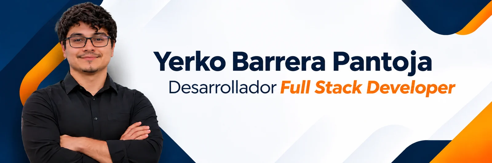
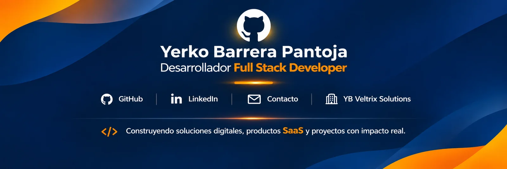

  

## Hola, soy Yerko

**Ingeniero en Computación e Informática · Licenciado en Ingeniería**

Soy **Full Stack Developer** y fundador de **YB Veltrix Solutions**, en la Región de Valparaíso, Chile. Desarrollo aplicaciones web, APIs REST y productos SaaS, desde los requerimientos y el modelado de datos hasta las pruebas y el despliegue. Mi experiencia previa en soporte TI incluye entornos hospitalarios y universitarios.

[**Portafolio**](https://veltrix.bpyerko.workers.dev/) &nbsp;·&nbsp; [**LinkedIn**](https://www.linkedin.com/in/yerko-andr%C3%A9s-barrera-pantoja-a82821123/) &nbsp;·&nbsp; [**Contacto**](https://veltrix.bpyerko.workers.dev/contacto)

## Trayectoria y formación

### Experiencia

- **YB Veltrix Solutions** · Fundador desde julio de 2025. Desarrollo de aplicaciones web, APIs REST y productos SaaS.
- **Grupo Belator** · Técnico de Soporte TI, julio de 2025 a mayo de 2026. Continuidad tecnológica, infraestructura y equipos.
- **Reimpact** · Ingeniero de Desarrollo de Software, septiembre a noviembre de 2025. Desarrollo de software a medida.
- **TIC Services SpA** · Soporte TIC para el Hospital Gustavo Fricke, diciembre de 2022 a febrero de 2025. Atención de incidencias en sistemas hospitalarios.
- **Nutech SpA** · Técnico de Soporte TI en la Universidad Andrés Bello, agosto de 2021 a diciembre de 2022. Tecnología para docencia y clases híbridas.

### Formación

- **Universidad Andrés Bello** · Ingeniería en Computación e Informática y Licenciado en Ingeniería, 2024–2026.
- **AIEP** · Técnico de Nivel Superior en Programación Computacional, 2017–2020.

## Stack tecnológico

**Frontend**

   &nbsp;<strong>React</strong> &nbsp;&nbsp;
   &nbsp;<strong>Next.js</strong> &nbsp;&nbsp;
   &nbsp;<strong>TypeScript</strong> &nbsp;&nbsp;
   &nbsp;<strong>Angular</strong> &nbsp;&nbsp;
   &nbsp;<strong>Tailwind CSS</strong>

**Backend**

   &nbsp;<strong>Node.js</strong> &nbsp;&nbsp;
   &nbsp;<strong>NestJS</strong>

**Datos**

   &nbsp;<strong>PostgreSQL</strong> &nbsp;&nbsp;
   &nbsp;<strong>MongoDB</strong> &nbsp;&nbsp;
   &nbsp;<strong>Prisma ORM</strong>

**DevOps y pruebas**

   &nbsp;<strong>Docker</strong> &nbsp;&nbsp;
   &nbsp;<strong>GitHub Actions</strong> &nbsp;&nbsp;
   &nbsp;<strong>Jest</strong> &nbsp;&nbsp;
   &nbsp;<strong>Playwright</strong>

**Nube**

   &nbsp;<strong>Cloudflare</strong> &nbsp;&nbsp;
   &nbsp;<strong>Netlify</strong>

## Proyectos seleccionados

| Proyecto | Enfoque |
| --- | --- |
| [Portafolio profesional](https://github.com/koyarxs/Project-06-Portafolio-Noviembre-2026) | Sitio Full Stack y presentación del trabajo de YB Veltrix Solutions. |
| [Zenvik](https://github.com/koyarxs/Project-05-Zenvik-Octubre-2026) | Interfaces web y servicios de backend con Next.js y Django REST. |
| [FraudShield](https://github.com/koyarxs/Project-01-FraudShield-Septiembre-2026) | MVP académico para clasificar riesgo con datos simulados. Sus resultados indican riesgo y no confirman fraude. |
| [Pawly](https://github.com/koyarxs/Project-03-Pawly-Octubre-2026) | Proyecto en etapa inicial con frontend en Next.js y evolución Full Stack planificada. |

## Actividad en GitHub

En GitHub desde junio de 2019 · corte al **23 de noviembre de 2026**.

**Commits** cuenta los cambios atribuidos a @koyarxs en las ramas predeterminadas de sus repositorios públicos, sin contar dos veces un mismo SHA. **Contribuciones visibles** suma el calendario público de GitHub e incluye otros tipos de actividad. Cada columna mide un conjunto distinto.

| Año | Commits públicos | Contribuciones visibles |
| --- | ---: | ---: |
| 2026 | 84 | 111 |
| 2025 | 15 | 18 |
| 2024 | 0 | 0 |
| 2023 | 0 | 0 |
| 2022 | 0 | 0 |
| 2021 | 0 | 0 |
| 2020 | 0 | 0 |
| 2019 | 0 | 1 |

### Detalle mensual

Ver los meses con actividad registrada

| Mes | Commits públicos | Contribuciones visibles |
| --- | ---: | ---: |
| Noviembre 2026 | 18 | 22 |
| Octubre 2026 | 51 | 68 |
| Septiembre 2026 | 9 | 13 |
| Agosto 2026 | 3 | 4 |
| Mayo 2026 | 3 | 4 |
| Junio 2025 | 15 | 18 |
| Junio 2019 | 0 | 1 |

[Calendario de GitHub](https://github.com/koyarxs?tab=overview#contributions) · [Repositorios públicos](https://github.com/koyarxs?tab=repositories)

---

  

